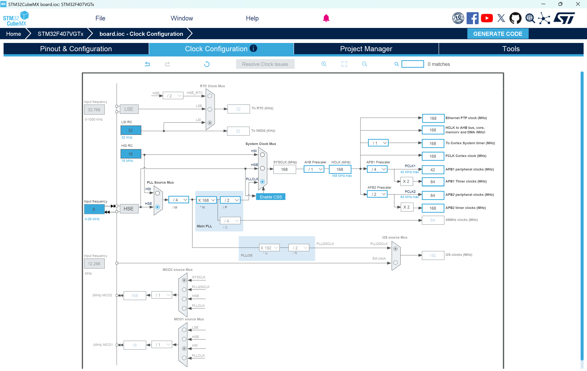
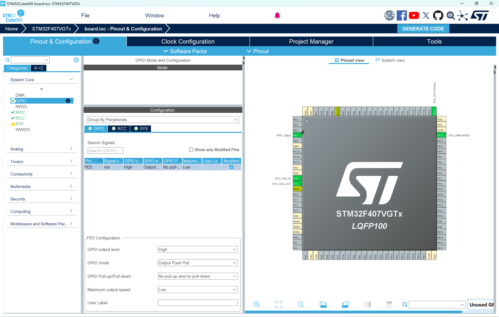
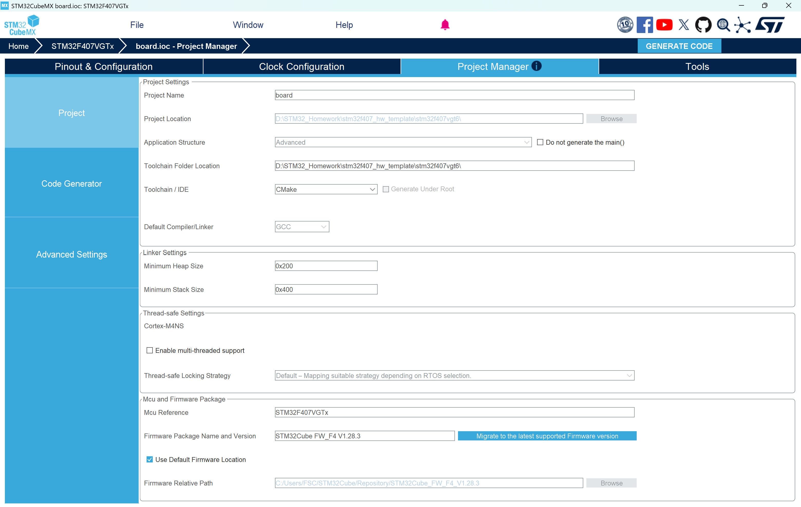
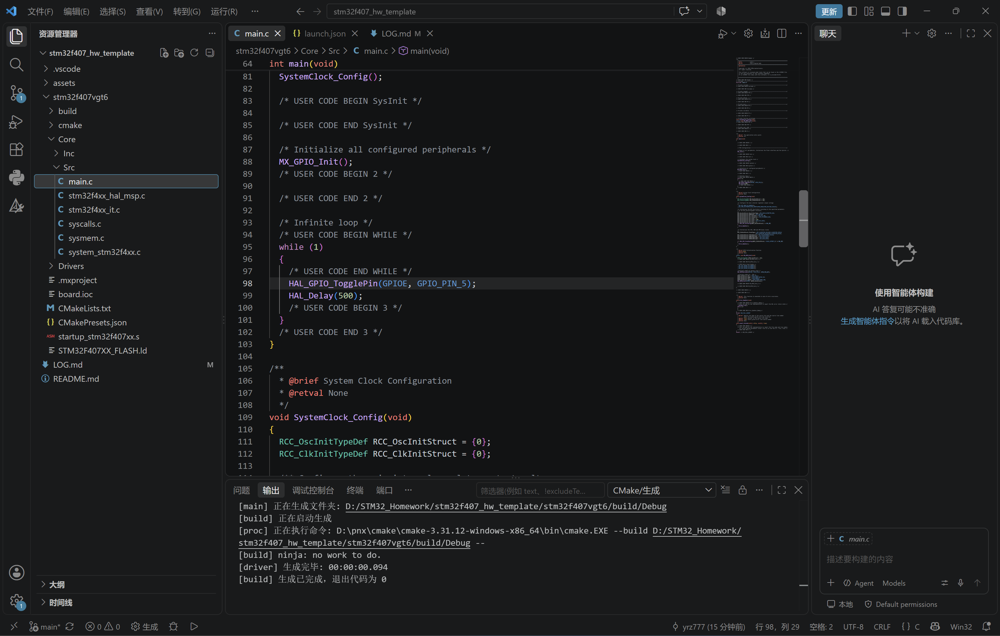

# STM32F407 作业日志

## 作业一：小灯闪烁
**完成日期**：2026-09-17
**任务描述**：配置VGT6的GPIO输出，实现LED灯周期性闪烁。
### 1. CubeMX 配置
**(1) 时钟树配置**
确保系统时钟配置为 168MHz。

**(2) GPIO 引脚配置**
将 PE5 配置为 GPIO_Output，用于控制 LED。

**(3) 生成工程配置**
确认工程名称和 IDE 选择。

### 2. 代码实现
在 main.c 中添加闪烁逻辑。
