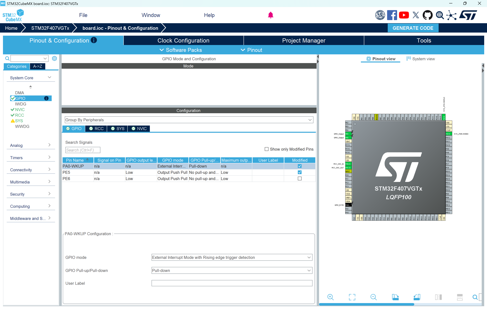
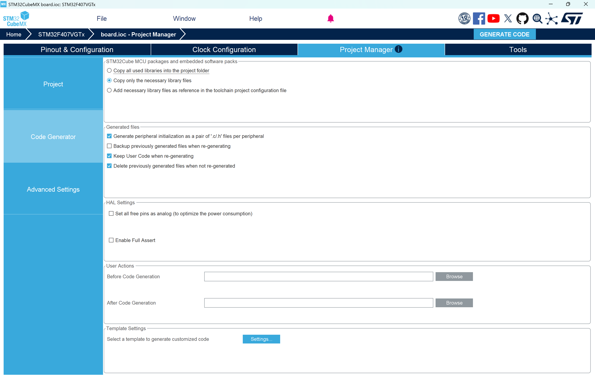
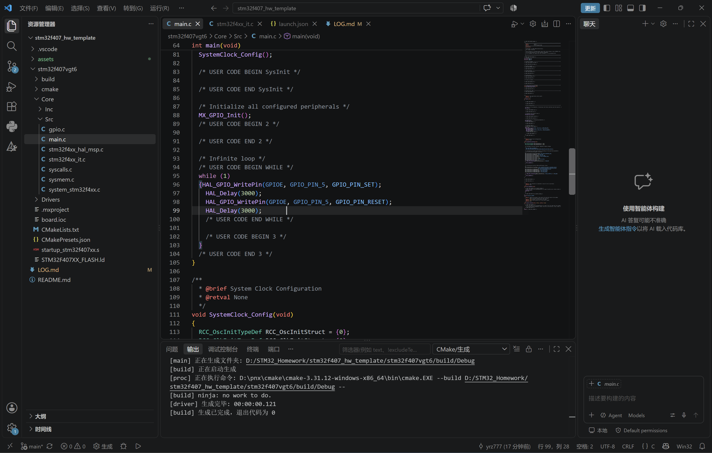
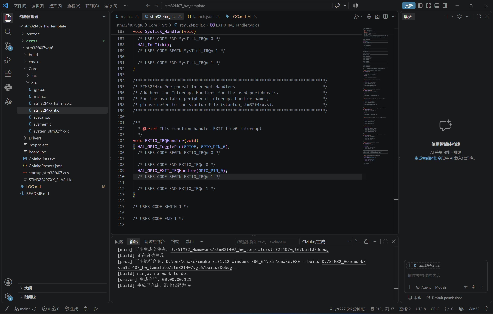

# STM32F407 作业日志

## 作业一：小灯闪烁
**完成日期**：2026-09-17
**任务描述**：配置VGT6的GPIO输出，实现LED灯周期性闪烁。

### 1. CubeMX 配置
**(1) 时钟树配置**
确保系统时钟配置为 168MHz。

**(2) GPIO 引脚配置**
将 PE5 配置为 GPIO_Output，用于控制 LED。

**(3) 生成工程配置**
确认工程名称和 IDE 选择。

### 2. 代码实现
在 main.c 中添加闪烁逻辑。

## 作业二：实现中断
**完成日期**：2026-09-19
**任务描述**：在作业一基础上，配置外部中断（按键），实现按键触发改变灯效。

### 1. CubeMX 配置
**(1) 时钟树配置**
确保系统时钟配置为 168MHz。

**(2) GPIO 引脚配置**
将 PE5和PE6 配置为 GPIO_Output，用于控制 LED，将 PA0 配置为 GPIO_EXTI0,用于检测按键的触发

**(3) 生成工程配置**
将文件目录分成hpp和cpp两种，便于管理

### 2. 代码实现
在 main.c 中添加闪烁逻辑，在 stm32f4xx_it.c 中添加中断逻辑

